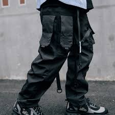

# <p align="center">⬛ KROMA. | DEFINE YOUR REALITY. ⬛</p>

<p align="center">
  
</p>

<p align="center">
  <strong>The ultimate high-fashion streetwear terminal for the digital age.</strong><br>
  Built with brutalist aesthetics, interactive 3D elements, and zero-lag precision.
</p>

<p align="center">
  
  
  
</p>

---

## ⚡ THE VISION

**KROMA** is not just an e-commerce platform—it's a digital experience. Drawing inspiration from high-end technical labels and underground cyber-culture, KROMA provides an immersive interface that pushes the boundaries of modern web development.

> *"Our fabrics are data. Our tailoring is code. Our reality is choice."*

---

## 🚀 KEY FEATURES

### 💎 1. Immersive 3D Experience
The hero section features a procedural, mouse-responsive wireframe object powered by **Three.js**. It creates a deep, spatial atmosphere the moment the user enters the terminal.
> *[Insert GIF of Three.js Hero Movement Here]*

### 🎯 2. Precision Custom Cursor
A high-performance interactive cursor system built with **GSAP QuickTo**. It delivers zero-lag tracking and dynamic expansion when hovering over interactive "nodes."
- `Logic:` Optimized for 120Hz+ displays.
- `Aesthetic:` Inverted color blending for maximum visibility.

### 🛍️ 3. Advanced Product Discovery
- **The Void Series:** A sleek, animated product grid showcasing technical garments.
- **Deep Detail View:** Modals featuring full product specs, 480GSM descriptions, and variant selection.
- **Variant Logic:** Intelligent selection for sizes and colors with visual feedback.

### 💳 4. Secure Transaction Protocol (Checkout)
A multi-step, simulated checkout experience:
1. **Shipment Terminal:** Global address input.
2. **Authorization Input:** Simulated encrypted payment entry.
3. **Data Validation:** Real-time processing animation.
4. **Manifest Assignment:** Success confirmation and order history logging.

---

## 🛠️ TECH STACK

<p align="center">
  
  
  
  
  
</p>

- **Core Engine:** Vanilla JavaScript (ES6+).
- **Styling:** Tailwind CSS CDN + Custom Brutalist CSS.
- **Motion:** GSAP (ScrollTrigger, QuickTo).
- **3D Render:** Three.js WebGL.
- **Smoothness:** Lenis Scroll for momentum-based interaction.
- **Icons:** Remix Icon Terminal.

---

## 📸 PREVIEW

<p align="center">
  
  
</p>

---

## 🔧 INSTALLATION

To run the **KROMA Terminal** locally:

1. **Clone the repository:**
   ```bash
   git clone https://github.com/YOUR_USERNAME/kroma.git
   ```
2. **Open the directory:**
   ```bash
   cd kroma
   ```
3. **Launch the experience:**
   Simply open `index.html` in any modern browser or use VS Code's **Live Server**.

---

## 🖋️ IDENTITY

- **Created by:** Amer Biberovic
- **Release Year:** 2026
- **Status:** Stable Alpha v1.0

---

<p align="center">
  
</p>

